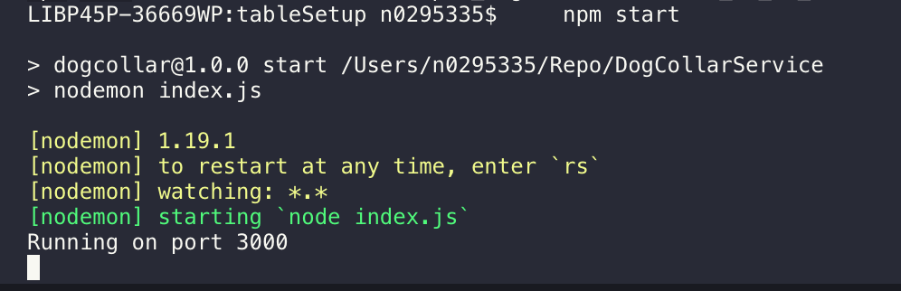
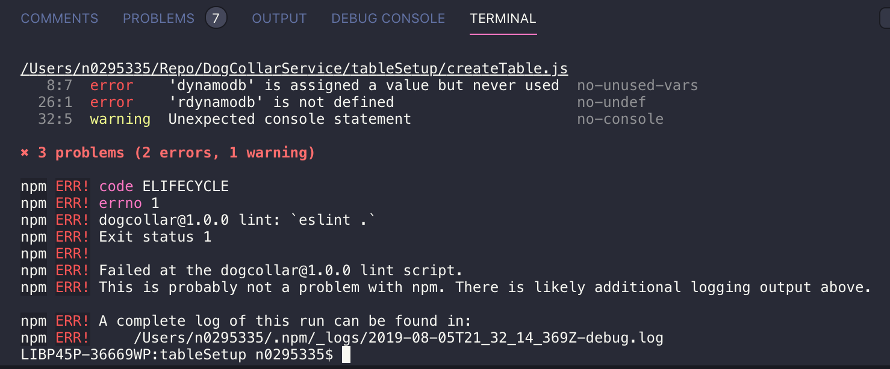
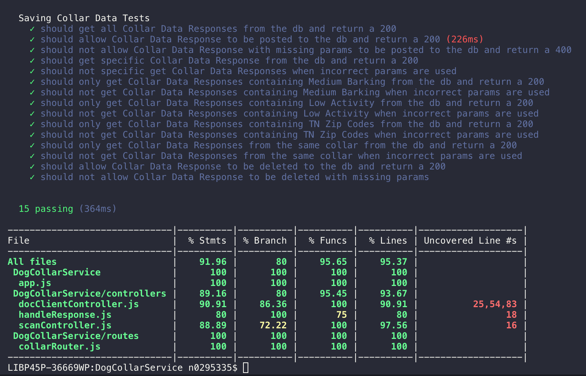

# DogCollarService
A NodeJS microservice that reads data from dog collars and saves it down to and queries a DynamoDB

## Running the App
```bash
# installs all the applications dependencies
npm install
```
```bash
# starts the node application
npm start
```
Starts the application



```bash
# runs es-lint
npm run lint
```
You will see the linting errors


```bash
# runs unit tests
npm run test
```
You will see the Instabul provided test coverages when test is run




## Commit Requirements
We are following the conventional commit [spec](https://www.conventionalcommits.org/en/v1.0.0-beta.2/#specification) to allow for easier changelog management. The general format for a commit message should look like:
```bash

# Full structure for a commit message
<type>[optional scope]: <JIRA ticket> <description>

[optional body]

[optional footer]

# standard example
docs: DS-11111 Update README to reflect CHANGELOG formatting requirements

# example with scope
feat(qps): DS-11111 Created new price area for QPS

# example when introducing breaking changes
feat: DS-11111 Some cool new feature

BREAKING CHANGE: Upgraded a cool feature so we can no longer do something else
```

With our configuration, the following types are allowed:
* docs - Used when making updates to the documentation for the application
* feat - Used with adding a new feature to the application
* fix - Used when fixing a bug within the application
* merge - Used when merging one branch into another (i.e. master into a local branch)
* refactor - Used when refactoring code for readability, performance gains, etc.
* revert - Used when rolling back to a prior commit
* style - Used when making changes ONLY to .css or .scss files
* test - Used when making changes ONLY to tests (i.e. adding a missing test case)

NOTE: If your change falls into more than one of these, then it should probably be refactored into smaller commits.

### Helpful Links
* [Swagger Documentation](http://ec2-52-91-239-59.compute-1.amazonaws.com:3999/swag-docs)
* [GitHub Repository](https://github.com/RoryConnolly/DogCollarService)
* [Post Man Collection](./documentation/DogCollar.postmanCollection.json)
